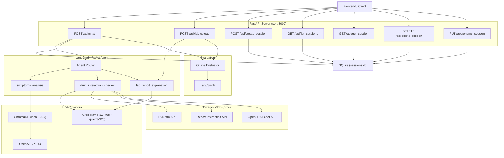

# Mo3een Medical Agent — Complete API Documentation

> **Base URL:** `http://localhost:8000`  
> **Framework:** FastAPI v1.0.0  
> **Prefix:** All REST endpoints are under `/api`  
> **Auto-docs:** `http://localhost:8000/docs` (Swagger UI) / `http://localhost:8000/redoc`

---

## Table of Contents

1. [Quick Reference](#1-quick-reference)
2. [HTTP REST Endpoints (7)](#2-http-rest-endpoints)
3. [Internal Agent Tools (3)](#3-internal-agent-tools)
4. [External APIs Consumed (3)](#4-external-apis-consumed)
5. [Guardrail & LLM Factory APIs](#5-guardrail--llm-factory-apis)
6. [Online Evaluation API](#6-online-evaluation-api)
7. [Pydantic Schemas Reference](#7-pydantic-schemas-reference)
8. [Environment Variables](#8-environment-variables)

---

## 1. Quick Reference

### HTTP REST Endpoints (all under `/api`)

| # | Method | Endpoint | Purpose |
|---|--------|----------|---------|
| 1 | `POST` | `/api/chat` | Main text chat (session-aware + stateless) |
| 2 | `POST` | `/api/lab-upload` | PDF/image lab report upload & analysis |
| 3 | `POST` | `/api/create_session` | Create new chat session |
| 4 | `GET` | `/api/list_sessions` | List user's sessions |
| 5 | `GET` | `/api/get_session` | Get full session history |
| 6 | `DELETE` | `/api/delete_session` | Delete a session |
| 7 | `PUT` | `/api/rename_session` | Rename a session |

### Internal Agent Tools

| Tool Name | Pipeline Summary |
|-----------|------------------|
| `symptoms_analysis` | RAG (ChromaDB) + GPT-4o diagnosis pipeline |
| `drug_interaction_checker` | Groq + RxNorm + RxNav + OpenFDA pipeline |
| `lab_report_explanation` | Groq + local JSON range checker pipeline |

---

## 2. HTTP REST Endpoints

All endpoints are registered under the `/api` prefix via `app.include_router(router, prefix="/api")`.

### 1.1 `POST /api/chat`

> Primary text chat endpoint — routes user queries through the LangChain ReAct agent.

| Field | Detail |
|-------|--------|
| **File** | [routes.py](file:///e:/medical-agent/api/routes.py#L80-L168) |
| **Response Model** | `ChatResponse` |
| **Auth** | None (CORS open) |

**Request Body** — `ChatRequest`:
```json
{
  "query": "string (required — must not be empty)",
  "thread_id": "string | null (optional — enables session-aware mode)",
  "user_id": "string | null (optional — required with thread_id)"
}
```

**Response** — `ChatResponse`:
```json
{
  "response": "string — the agent's or tool's answer",
  "tool_used": "string | null — e.g. 'symptoms_analysis', 'drug_interaction_checker', 'lab_report_explanation', or null"
}
```

**Behaviour:**
- **Session-aware mode** (`thread_id` + `user_id` provided): loads conversation history from SQLite, appends new messages, auto-names session from first message
- **Stateless mode** (no session fields): single-turn query, no history persistence
- **Background task**: triggers online safety evaluation via LangSmith if `LIVE_EVAL_ENABLED=true`

**Errors:**
| Code | Condition |
|------|-----------|
| `400` | Empty query |
| `404` | Session not found or user mismatch |

---

### 1.2 `POST /api/lab-upload`

> Upload a PDF or image lab report for automated analysis.

| Field | Detail |
|-------|--------|
| **File** | [routes.py](file:///e:/medical-agent/api/routes.py#L175-L248) |
| **Response Model** | `ChatResponse` |
| **Content-Type** | `multipart/form-data` |

**Request:**
| Parameter | Type | Description |
|-----------|------|-------------|
| `file` | `UploadFile` (required) | PDF or image file (JPEG, PNG, TIFF, BMP) |
| `lang` | `str` (default `"en"`) | Response language (`"ar"` or `"en"`) |

**Supported MIME types:**
- `application/pdf`
- `image/jpeg`, `image/jpg`, `image/png`, `image/tiff`, `image/bmp`

**Max file size:** 10 MB

**Pipeline:**
1. Validate content type and size
2. Extract text via `pdf_parser.parse_pdf()` or `ocr_parser.parse_image()`
3. Pass extracted text to `lab_report_explanation` tool directly
4. Return formatted markdown report

**Errors:**
| Code | Condition |
|------|-----------|
| `400` | Empty file |
| `413` | File exceeds 10 MB |
| `415` | Unsupported MIME type |
| `422` | Could not extract text from file |

---

### 1.3 `POST /api/create_session`

> Create a new chat session for a user.

| Field | Detail |
|-------|--------|
| **File** | [routes.py](file:///e:/medical-agent/api/routes.py#L255-L265) |
| **Response Model** | `CreateSessionResponse` |

**Request Body** — `CreateSessionRequest`:
```json
{ "user_id": "string (required)" }
```

**Response** — `CreateSessionResponse`:
```json
{ "thread_id": "uuid-string" }
```

**Errors:** `400` if `user_id` is empty.

---

### 1.4 `GET /api/list_sessions`

> List all sessions for a user, ordered newest first.

| Field | Detail |
|-------|--------|
| **File** | [routes.py](file:///e:/medical-agent/api/routes.py#L272-L281) |
| **Response Model** | `list[SessionSummary]` |

**Query Parameters:**
| Param | Type | Description |
|-------|------|-------------|
| `user_id` | `str` (required) | The user identifier |

**Response** — array of `SessionSummary`:
```json
[
  {
    "thread_id": "uuid-string",
    "session_name": "string | null",
    "created_at": "ISO 8601 timestamp"
  }
]
```

---

### 1.5 `GET /api/get_session`

> Get the full message history for a specific session.

| Field | Detail |
|-------|--------|
| **File** | [routes.py](file:///e:/medical-agent/api/routes.py#L288-L309) |
| **Response Model** | `SessionDetail` |

**Query Parameters:**
| Param | Type | Description |
|-------|------|-------------|
| `thread_id` | `str` (required) | Session UUID |
| `user_id` | `str` (required) | User identifier (ownership check) |

**Response** — `SessionDetail`:
```json
{
  "thread_id": "uuid-string",
  "session_name": "string | null",
  "created_at": "ISO 8601",
  "messages": [
    { "role": "user", "content": "..." },
    { "role": "assistant", "content": "..." }
  ]
}
```

**Errors:** `400` empty params, `404` session not found / access denied.

---

### 1.6 `DELETE /api/delete_session`

> Delete a specific session.

| Field | Detail |
|-------|--------|
| **File** | [routes.py](file:///e:/medical-agent/api/routes.py#L316-L332) |

**Query Parameters:** `thread_id` (required), `user_id` (required)

**Response:**
```json
{ "status": "success" }
```

**Errors:** `400` empty params, `404` not found.

---

### 1.7 `PUT /api/rename_session`

> Rename a specific session.

| Field | Detail |
|-------|--------|
| **File** | [routes.py](file:///e:/medical-agent/api/routes.py#L339-L354) |

**Request Body** — `RenameSessionRequest`:
```json
{
  "thread_id": "string",
  "user_id": "string",
  "new_name": "string"
}
```

**Response:**
```json
{ "status": "success" }
```

**Errors:** `400` empty fields, `404` not found.

---

### 1.8 `GET /` (Root)

> Serves the static frontend HTML.

| Field | Detail |
|-------|--------|
| **File** | [main.py](file:///e:/medical-agent/main.py#L68-L76) |
| **Response** | `FileResponse` → `static/index.html` |

---

## 2. Internal Agent Tools

These are LangChain `@tool`-decorated functions invoked by the ReAct agent. They are **not** HTTP endpoints — the agent calls them internally based on query routing.

### 2.1 `symptoms_analysis`

> RAG + GPT-4o diagnostic pipeline for symptom queries.

| Field | Detail |
|-------|--------|
| **File** | [symptoms_tool.py](file:///e:/medical-agent/agent/tools/symptoms/symptoms_tool.py) |
| **LLM** | OpenAI GPT-4o (for diagnosis) |
| **RAG** | ChromaDB local vector store |

**Signature:**
```python
def symptoms_analysis(symptoms: str, language: str = None) -> str
```

**Pipeline:**
1. **Guardrail** → language detection + medical relevance check (Groq llama-3.1-8b)
2. **Input validation** → `SymptomsInput` Pydantic schema
3. **RAG retrieval** → ChromaDB similarity search (local, free)
4. **LLM diagnosis** → GPT-4o structured JSON output
5. **Output schema** → `SymptomsAnalysisOutput` Pydantic validation
6. **Formatting** → language-aware human-readable response

---

### 2.2 `drug_interaction_checker`

> Multi-API drug interaction checking pipeline (100% free external APIs).

| Field | Detail |
|-------|--------|
| **File** | [drug_tool.py](file:///e:/medical-agent/agent/tools/drug/drug_tool.py) |
| **LLMs** | Groq (extraction + report synthesis) |
| **External APIs** | RxNorm, RxNav, OpenFDA |

**Signature:**
```python
def drug_interaction_checker(drugs: str, language: str = None) -> str
```

**Pipeline:**
1. **Language detection** → `detect_language()` guardrail
2. **Drug name extraction** → Groq LLM extracts names from free text
3. **RxNorm normalization** → drug name → RxCUI identifier
4. **OpenFDA dosage lookup** → dosage form, route, warnings, contraindications
5. **RxNav interaction check** → drug-drug interactions with severity levels
6. **Report synthesis** → Groq writes patient-friendly report (AR/EN)

**Severity Levels:** `contraindicated` | `serious` | `moderate` | `minor` | `unknown`

---

### 2.3 `lab_report_explanation`

> Structured lab report analysis with local range checking.

| Field | Detail |
|-------|--------|
| **File** | [lab_tool.py](file:///e:/medical-agent/agent/tools/lab/lab_tool.py) |
| **LLM** | Groq (extraction + explanation) |
| **Data** | Local JSON reference ranges |

**Signature:**
```python
def lab_report_explanation(report: str, language: str = None) -> str
```

**Pipeline:**
1. **Language detection** → `detect_language()` guardrail
2. **Parameter extraction** → Groq extracts `{name, value, unit}` from raw text
3. **Range checking** → local JSON lookup (zero API calls)
4. **Explanation generation** → Groq explains each parameter
5. **Markdown formatting** → `report.to_markdown()`

---

## 3. External APIs Consumed

All three are **free, US government medical databases** — no API key required.

### 3.1 RxNorm API

> Drug name normalization — converts names to RxCUI identifiers.

| Field | Detail |
|-------|--------|
| **Base URL** | `https://rxnav.nlm.nih.gov/REST/` |
| **Client** | [rxnorm_client.py](file:///e:/medical-agent/agent/tools/drug/rxnorm_client.py) |
| **Cost** | Free, no API key |
| **Docs** | [RxNorm API Reference](https://lhncbc.nlm.nih.gov/RxNav/APIs/RxNormAPIs.html) |

**Endpoints used:**

| Endpoint | Purpose |
|----------|---------|
| `GET /rxcui.json?name={drug}&search=1` | Exact drug name → RxCUI lookup |
| `GET /approximateTerm.json?term={drug}&maxEntries=1` | Fuzzy fallback search |
| `GET /rxcui/{rxcui}/property.json?propName=RxNorm Name` | RxCUI → canonical drug name |
| `GET /rxcui/{rxcui}.json` | Fallback name lookup |

**Config:** Timeout 8s, 2 retries with 1s delay.

---

### 3.2 RxNav Interaction API

> Drug-drug interaction checking with severity classification.

| Field | Detail |
|-------|--------|
| **Base URL** | `https://rxnav.nlm.nih.gov/REST/interaction/` |
| **Client** | [rxnav_client.py](file:///e:/medical-agent/agent/tools/drug/rxnav_client.py) |
| **Cost** | Free, no API key |
| **Docs** | [RxNav Interaction API](https://lhncbc.nlm.nih.gov/RxNav/APIs/InteractionAPIs.html) |

**Endpoint used:**

| Endpoint | Purpose |
|----------|---------|
| `GET /list.json?rxcuis={id1}+{id2}+...` | Fetch all interactions between drugs |

**Data Sources:** ONCHigh, DrugBank, Clinical Pharmacology, Epocrates, Lexi-Interact, Multum, Natural Medicines

**Config:** Timeout 10s, 2 retries with 1s delay.

---

### 3.3 OpenFDA Drug Label API

> FDA drug label information — dosage, warnings, contraindications.

| Field | Detail |
|-------|--------|
| **Base URL** | `https://api.fda.gov/drug/label.json` |
| **Client** | [openfda_client.py](file:///e:/medical-agent/agent/tools/drug/openfda_client.py) |
| **Cost** | Free (1000 req/day without key) |
| **Docs** | [OpenFDA Drug Label API](https://open.fda.gov/apis/drug/label/) |

**Search cascade (tries in order):**

| # | Search Parameter | Example |
|---|-----------------|---------|
| 1 | `openfda.generic_name` | `"warfarin"` |
| 2 | `openfda.brand_name` | `"Coumadin"` |
| 3 | `openfda.substance_name` | fallback free-text |

**Fields extracted:** `dosage_form`, `route`, `dosage_and_administration`, `warnings`, `boxed_warning`, `contraindications`

**Config:** Timeout 8s, 2 retries, max text truncation 400 chars.

---

## 4. Guardrail & LLM Factory APIs

### 4.1 Medical Guardrail

| Field | Detail |
|-------|--------|
| **File** | [medical_guardrail.py](file:///e:/medical-agent/agent/guardrails/medical_guardrail.py) |

**Public Functions:**

| Function | Signature | Description |
|----------|-----------|-------------|
| `detect_language(text)` | `str → str` | Returns ISO 639-1 code (e.g. `"ar"`, `"en"`). Uses `langdetect` library (local). Falls back to `"en"`. |
| `is_medical_query(query)` | `str → bool` | LLM classification via Groq (llama-3.1-8b). Fails open (returns `True`) on API errors. |
| `get_refusal_message(lang)` | `str → str` | Returns polite refusal in AR/EN/default. |
| `run_guardrails(query)` | `str → GuardrailResult` | Combines language detection + medical check. Returns `.passed`, `.language`, `.refusal_message`. |

### 4.2 LLM Factory

| Field | Detail |
|-------|--------|
| **File** | [llm_factory.py](file:///e:/medical-agent/agent/llm_factory.py) |

```python
def get_groq_llm(model_name: str = "llama-3.3-70b-versatile", temperature: float = 0) -> ChatGroq
```

**Features:**
- Automatic API key rotation across `GROQ_API_KEY`, `GROQ_KEY_1`, `GROQ_KEY_2`, `GROQ_KEY_3`
- LangChain `.with_fallbacks()` for daily quota exhaustion
- `max_retries=4` for per-minute rate limit backoff

---

## 5. Online Evaluation API

### 5.1 Live Evaluation Background Task

| Field | Detail |
|-------|--------|
| **File** | [online_evaluator.py](file:///e:/medical-agent/evaluation/online_evaluator.py) |
| **Trigger** | Background task on every `/api/chat` and `/api/lab-upload` request |
| **Gate** | Only runs if `LIVE_EVAL_ENABLED=true` in `.env` |

```python
async def run_online_evaluation(run_id: str, user_input: str, agent_output: str)
```

**Pipeline:**
1. Generate expected clinical labels dynamically via Groq (`llama-3.3-70b-versatile`)
2. Run all weight ≥ 4 safety evaluators from `METRIC_REGISTRY`
3. Run `clinical_correctness_judge` and `elderly_language_judge` LLM judges
4. Submit feedback scores to **LangSmith** via `client.create_feedback()`
5. If any weight-5 metric scores < 0.8 → add run to `mo3een-live-review` annotation queue
6. Save failing runs to LangSmith dataset for future offline evaluation

### 5.2 LangSmith Integration

| Operation | API Call |
|-----------|----------|
| Submit metric score | `client.create_feedback(run_id, key, score, comment)` |
| Create/find annotation queue | `client.list_annotation_queues()` / `client.create_annotation_queue()` |
| Add run for human review | `client.add_runs_to_annotation_queue(queue_id, run_ids)` |
| Save failing case to dataset | `client.create_example(inputs, outputs, metadata, dataset_id)` |

---

## 6. Pydantic Schemas Reference

### HTTP Schemas (in [routes.py](file:///e:/medical-agent/api/routes.py#L38-L73))

| Schema | Fields |
|--------|--------|
| `ChatRequest` | `query: str`, `thread_id: str \| None`, `user_id: str \| None` |
| `ChatResponse` | `response: str`, `tool_used: str \| None` |
| `CreateSessionRequest` | `user_id: str` |
| `CreateSessionResponse` | `thread_id: str` |
| `RenameSessionRequest` | `thread_id: str`, `user_id: str`, `new_name: str` |
| `SessionSummary` | `thread_id: str`, `session_name: str \| None`, `created_at: str` |
| `SessionDetail` | `thread_id: str`, `session_name: str \| None`, `created_at: str`, `messages: list[dict]` |

### Database Schema (SQLite — [db.py](file:///e:/medical-agent/api/db.py))

```sql
CREATE TABLE sessions (
    thread_id    TEXT PRIMARY KEY,
    session_name TEXT,
    user_id      TEXT NOT NULL,
    created_at   TEXT NOT NULL,
    messages     TEXT NOT NULL DEFAULT '[]'  -- JSON blob
);
CREATE INDEX idx_sessions_user ON sessions(user_id);
```

**DB Location:** `data/sessions.db`

---

## 7. Environment Variables

| Variable | Required | Description |
|----------|----------|-------------|
| `OPENAI_API_KEY` | ✅ | OpenAI key for GPT-4o (symptoms diagnosis) |
| `GROQ_API_KEY` | ✅ | Primary Groq key (guardrails, drug extraction, lab analysis, report synthesis) |
| `GROQ_KEY_1` | ❌ | Backup Groq key #1 (auto-rotation) |
| `GROQ_KEY_2` | ❌ | Backup Groq key #2 (auto-rotation) |
| `GROQ_KEY_3` | ❌ | Backup Groq key #3 (auto-rotation) |
| `LANGSMITH_API_KEY` | ❌ | LangSmith tracing & evaluation |
| `LANGSMITH_TRACING` | ❌ | Enable tracing (`"true"`) |
| `LANGCHAIN_PROJECT` | ❌ | LangSmith project name (default: `mo3een-evaluation`) |
| `LIVE_EVAL_ENABLED` | ❌ | Enable online safety evaluation (`"true"` / `"false"`) |

---

## API Architecture Summary


