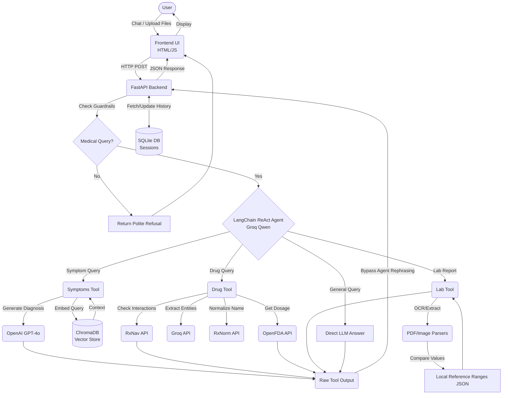

# MedAgent AI — Master Technical Documentation

## 1. SYSTEM OVERVIEW

### 1.1 What is the system?
**MedAgent** is a sophisticated, AI-powered medical assistant specifically engineered to help patients (with a focus on the elderly) navigate their medical concerns. The system acts as a specialized conversational agent capable of analyzing symptoms, checking drug interactions, and explaining complex laboratory test results.

### 1.2 What problem does it solve?
Navigating the healthcare system can be overwhelming, especially for elderly patients dealing with polypharmacy (multiple medications) or confusing lab reports. While standard LLMs can provide medical information, they are prone to dangerous "hallucinations" and lack integration with verified clinical databases. 

MedAgent solves this by creating a **secure, constrained AI environment**:
- It intercepts raw LLM outputs to prevent hallucinated medical advice.
- It grounds its responses in verified data sources (RAG with medical docs, FDA databases).
- It provides patient-friendly, multilingual (Arabic and English) explanations that are easy to understand.

### 1.3 Key Features
- **Symptom Analysis (RAG Pipeline):** Analyzes user-described pain or discomfort by retrieving context from a localized vector database containing verified medical literature, then generates a structured diagnosis.
- **Drug Interaction Checker:** Automatically extracts drug names from user queries and checks them against official US government databases (RxNorm, RxNav, OpenFDA) to identify potential adverse interactions and provide dosage guidelines.
- **Lab Report Explanation:** Allows users to upload lab reports (PDF or Images via OCR) and breaks down the medical jargon, cross-referencing values against standard reference ranges to explain what the results mean.
- **Persistent Chat Sessions:** Tracks conversational context across sessions using a localized SQLite database, allowing users to revisit previous medical discussions.
- **Medical Guardrails:** Hard-coded pre-computation checks that instantly drop non-medical queries (e.g., politics, sports) to save compute tokens and keep the agent focused.

### 1.4 Target Users
The primary target users are **Elderly Patients** and their caregivers. The system is designed with warm, patient, and empathetic conversational guardrails. It supports multiple languages (Arabic and English) to accommodate diverse demographics, recognizing and automatically routing responses in the user's native tongue.

### 1.5 High-Level Architecture Explanation
The application follows a **ReAct (Reasoning and Acting) Agent architecture** managed by LangChain. 
At its core, a fast, cost-efficient Groq LLM acts as a "Router." When a user asks a question, the Router decides if the query requires a specialist tool. If a tool is invoked, the system explicitly intercepts the raw, strictly-typed tool output and returns it directly to the user. This "Tool Interception" deliberately bypasses the LLM's final rephrasing step, preventing the model from accidentally modifying critical medical data.

---

## 2. ARCHITECTURE DESIGN

The system is highly modular, split between a stateless presentation layer, an API routing layer, a database persistence layer, and a multi-agent AI tool suite.

### 2.1 Frontend
- **Technology:** Vanilla HTML, CSS, and JavaScript.
- **Delivery:** Served statically via the FastAPI backend (`/static/index.html`).
- **Functionality:** Provides a clean, accessible chat interface where users can type queries or upload lab report files (PDFs/Images). It handles session management on the client side by maintaining a `thread_id`.

### 2.2 Backend
- **Framework:** FastAPI (Python).
- **Core Endpoints:**
  - `POST /api/chat`: Handles text-based chat, loading conversation history and invoking the LangChain agent.
  - `POST /api/lab-upload`: Handles file uploads, validating MIME types, extracting text via parsers, and triggering the Lab tool.
  - Session Management: `create_session`, `list_sessions`, `get_session`, `delete_session`, `rename_session`.
- **Concurrency:** Uses FastAPI's asynchronous routing and internal threadpools to prevent the main event loop from blocking during heavy LLM or API calls.

### 2.3 AI/ML Components
- **The Core Agent (Router):** Powered by LangChain and Groq (`qwen/qwen3-32b`). Evaluates the query against a strictly defined System Prompt to select the right tool.
- **Symptoms Tool (`symptoms_analysis`):** 
  - **RAG Pipeline:** Uses a local ChromaDB instance populated with HuggingFace embeddings of medical documents.
  - **Generator:** Uses OpenAI's GPT-4o with strict Pydantic V2 schemas (`JSON_OBJECT`) to guarantee structured clinical formatting.
- **Lab Tool (`lab_report_explanation`):**
  - **Parsers:** Extracts text from PDFs (`PyPDF2`/`pdfplumber`) and Images (OCR).
  - **Logic:** Compares extracted values against local JSON reference ranges, passing data to Groq for patient-friendly synthesis.
- **Drug Tool (`drug_interaction_checker`):**
  - Uses Groq to run Named Entity Recognition (NER) to extract drug names from raw text.
  - Synthesizes complex pharmacological data into an easy-to-read report.

### 2.4 Database
- **Conversational Persistence:** Local `SQLite` database (`sessions.db`). Stores chat histories as JSON blobs associated with a specific `user_id` and `thread_id`.
- **Vector Store:** Local `ChromaDB`. Stores vector embeddings of medical literature for the Symptoms RAG pipeline, ensuring offline, secure, and free retrieval without relying on external cloud vector databases.

### 2.5 External APIs
- **Groq API:** Provides ultra-fast inference for the main Agent Router and intermediate NLP tasks (like drug name extraction).
- **OpenAI API:** Powers the complex reasoning required for the Symptoms RAG diagnosis (GPT-4o).
- **US National Library of Medicine (NIH) APIs:**
  - **RxNorm:** Normalizes colloquial drug names into standard RxCUI codes.
  - **RxNav:** Uses RxCUI codes to identify known drug-drug interactions and their severities.
- **OpenFDA API:** Retrieves official drug dosage guidelines and warnings from the FDA database.

---

## 3. SYSTEM INTERACTION FLOW (MERMAID DIAGRAM)

---

## 4. SECURITY & SCALABILITY CONSIDERATIONS
1. **Tool Interception:** By returning the exact string generated by the specialized tools directly to the FastAPI router, MedAgent mitigates the risk of the main agent's LLM "smoothing over" or hallucinating numbers during a final translation pass.
2. **Stateless Scalability:** The backend can easily be containerized and scaled horizontally behind a load balancer, as session state is outsourced to the SQLite database. (For production deployment, SQLite can be swapped for PostgreSQL).
3. **Pydantic Validation:** All inputs to tools and outputs from the GPT-4o model are strictly validated using Pydantic, ensuring that the system fails gracefully if unexpected formats are returned by an API.
