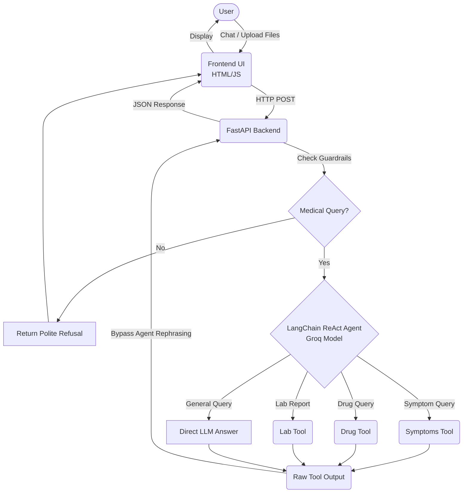

<div align="center">
  
  <h1 align="center">Mo3een (MedAgent AI)</h1>
  <p align="center">
    <strong>A Sophisticated, Safe, and Stateless AI Medical Assistant</strong>
    <br />
    <br />
    <a href="#-architecture">Architecture</a>
    ·
    <a href="#-getting-started">Getting Started</a>
    ·
    <a href="#-features">Features</a>
  </p>
</div>

<!-- Badges -->
<div align="center">
  
  
  
  
</div>

## 📖 About The Project

**Mo3een (MedAgent)** is an AI-powered medical assistant specifically engineered to help patients—with a focus on the elderly—navigate their medical concerns securely and accurately. 

Navigating the healthcare system can be overwhelming, especially for patients dealing with polypharmacy (multiple medications) or confusing lab reports. While standard LLMs can provide medical information, they are prone to dangerous "hallucinations" and lack integration with verified clinical databases. 

Mo3een solves this by creating a **secure, constrained AI environment**:
- **Zero Hallucination Tolerance:** It intercepts raw LLM outputs when specialist tools are used, bypassing LLM rephrasing steps.
- **Ground Truth Grounding:** Grounds its responses in verified data sources (RAG with medical docs, US National Library of Medicine databases).
- **Empathy & Accessibility:** Provides patient-friendly, multilingual (Arabic and English) explanations that are easy to understand.
- **Stateless Architecture:** Fully stateless application ensuring scalability and data privacy.

---

## ✨ Key Features

* **🩺 Symptom Analysis (RAG Pipeline):** Analyzes user-described pain or discomfort by retrieving context from a localized vector database (ChromaDB) containing verified medical literature, generating a structured and clinically sound diagnosis.
* **💊 Drug Interaction Checker:** Automatically extracts drug names from queries (via NER) and checks them against official US government databases (RxNorm, RxNav, OpenFDA) to identify potential adverse interactions and provide dosage guidelines.
* **🧪 Lab Report Explanation:** Allows users to upload lab reports (PDF or Images via OCR). It breaks down medical jargon and cross-references values against standard reference ranges to explain results in plain language.
* **🛡️ Medical Guardrails:** Hard-coded pre-computation checks that instantly drop non-medical queries (e.g., politics, sports) to save compute tokens and maintain system focus.
* **🚫 Stateless Design:** All conversation logic is strictly managed statelessly without retaining multi-session chat history, enforcing pure request-response flows that are infinitely scalable and highly secure.

---

## 🏗 Architecture

The application follows a **ReAct (Reasoning and Acting) Agent architecture** managed by LangChain. 

A fast, cost-efficient Groq LLM (e.g., `qwen/qwen3-32b`) acts as a "Router." When a user asks a question, the Router decides if the query requires a specialist tool. If a tool is invoked, the system explicitly intercepts the raw, strictly-typed tool output and returns it directly to the user. This "Tool Interception" deliberately bypasses the LLM's final rephrasing step, preventing the model from accidentally altering critical medical data.



---

## 🚀 Getting Started

Follow these steps to set up and run the Mo3een backend and frontend locally.

### 1. Prerequisites

- Python 3.10+
- `pip` (Python package manager)

### 2. Installation

Clone the repository and install the required dependencies:

```bash
git clone <your-repo-url>
cd medical-agent
pip install -r requirements.txt
```

### 3. Configuration

Create a `.env` file in the root directory and configure your API keys:

```env
OPENAI_API_KEY="your_openai_api_key"
GROQ_API_KEY="your_groq_api_key"
LANGCHAIN_TRACING_V2="true"
LANGCHAIN_API_KEY="your_langsmith_api_key"
LANGCHAIN_PROJECT="medical-agent"
ANONYMIZED_TELEMETRY="False"
PYTHONIOENCODING="utf-8"
```

### 4. Data Ingestion (Symptoms RAG)

To populate your local medical knowledge base using documents stored in `data/medical_docs/`:

```bash
python -m agent.tools.symptoms.ingest
```

### 5. Running the Application

Start the FastAPI application server:

```bash
uvicorn main:app --reload --port 8000
```

The server will start on `http://localhost:8000`. The frontend interface is served statically from this endpoint.

---

## 🧪 Evaluation & Testing

The system employs a rigorous evaluation and testing module, including both **Offline Unit/Integration Testing** and **Online LangSmith Evaluation**.

### Running Automated Tests
The project relies on `pytest` for offline logic validation and to prevent unnecessary API bandwidth costs. 
```bash
pytest tests/
```

### Running Evaluation Pipeline
To validate the reasoning agents against the dataset targets:
```bash
python -m evaluation.run_batch
```
The evaluation report is automatically generated and synced with LangSmith to track core metrics (Helpfulness, Medical Safety, Tone, etc.).

---

## 📚 Documentation
For more in-depth technical details, please refer to our internal documentation:
- [Master Architecture Documentation](MASTER_DOCUMENTATION.md)
- [API Documentation](API_DOCUMENTATION.md)
- [Evaluation Report](EVALUATION_REPORT.md)

---

## 📄 License
This project is proprietary and intended for controlled use. All rights reserved.
